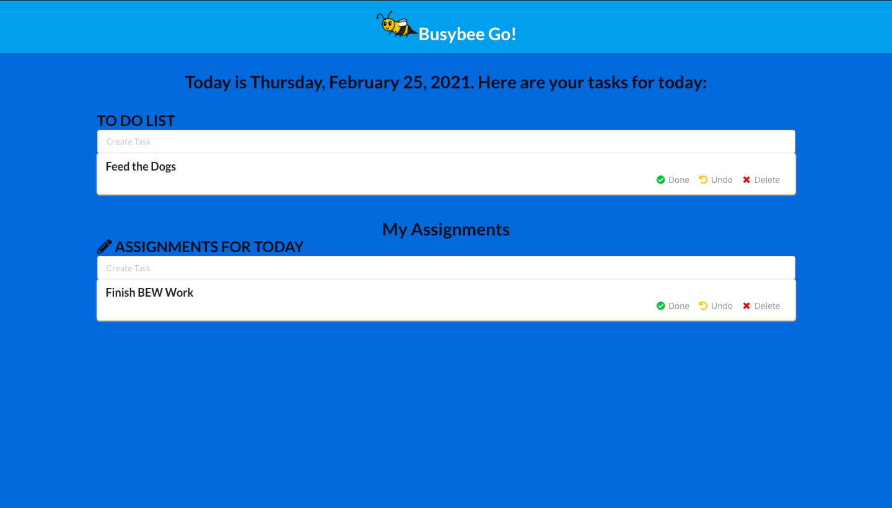

# busybee [go!] :bee:
by reikamoon :ribbon:

## About :bee:
A to-do-list app created in Go and React, with MongoDB as a database. A remake of one of my older projects, busybee:bee:, which was made in 2020 and developed with flask, mongodb, and jinja.

## Materials :books:
* I followed [this tutorial](https://levelup.gitconnected.com/build-a-todo-app-in-golang-mongodb-and-react-e1357b4690a6) to help me get started.
* I used [this tutorial](https://www.w3schools.com/js/js_date_methods.asp) to help me implement dates into my app.

## Requirements :heavy_exclamation_mark:

### Golang Server Requirement

:one: Golang https://golang.org/dl/ 
:two: gorilla/mux package for router `go get -u github.com/gorilla/mux` 
:three: mongo-driver package to connect with mongoDB `go get go.mongodb.org/mongo-driver`

## How to Get Started :bulb:
:one:  Clone the Repo: 
`git clone https://github.com/reikamoon/go-busybee.git`

:two: <b> From the go-server directory, run:</b>
`go run main.go`

:three:<b> From the client directory, run:</b>
`npm install` to install dependencies, and then:
`npm start` or `yarn start`

## What is busybee [go!]? :thinking:
Simple to-do-list app that allows users to create tasks, mark them as complete, and delete as needed.

### Create a Task :heavy_plus_sign:

Type in a task in the textbox prompt and hit enter.

### Task Completed :heavy_check_mark:

On completion of a task, click "done" icon of the respective task card.

You'll notice on completion of task, the card's bottom line color changed from yellow to green.

### Undo a Task :heavy_minus_sign:

To undo a task, click on the "undo" Icon,

You'll notice on completion of task, card's bottom line color changed from green to yellow.

### Delete a Task :x:

To delete a task, click the "delete" Icon.

